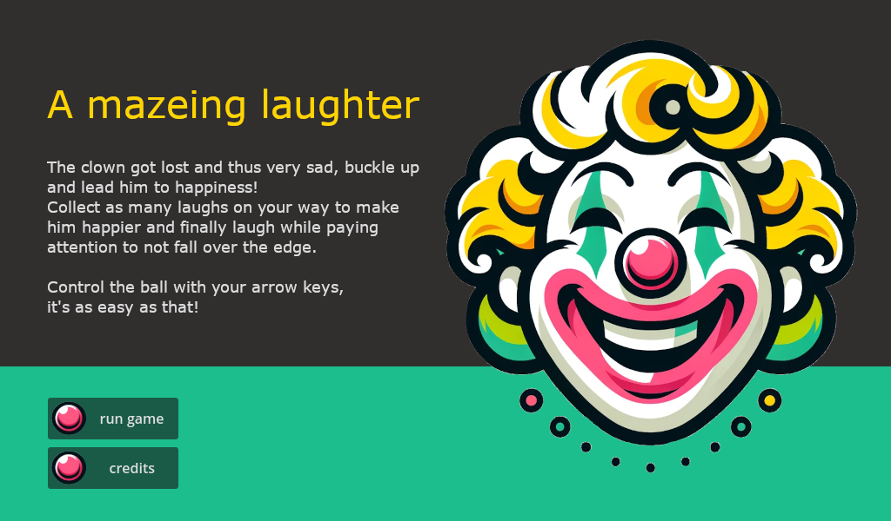
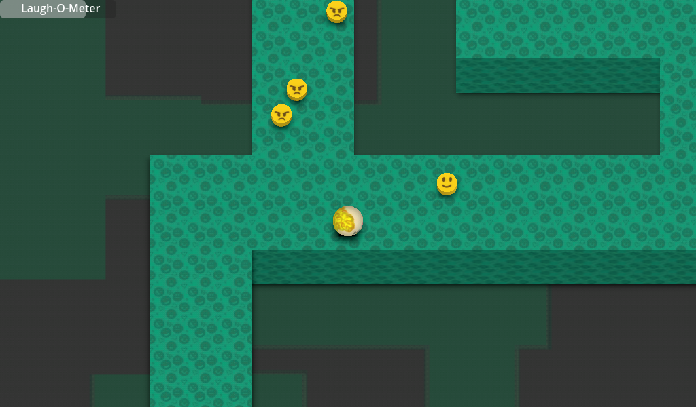

# A mazeing laughter

The clown got lost and thus very sad, buckle up and lead him to happiness!\
Collect as many laughs on your way to make him happier and finally laugh while paying attention to not fall over the edge.

Control the ball with your arrow keys, it's as easy as that!

This game was made for the [Global Game Jam 2024](https://globalgamejam.org/games/2024/mazeing-laughter-8) in 48 hours.

Thanks to [TradeByte](https://www.tradebyte.com) for providing the jam site.

▶ Play it online on [https://a-mazeing-laughter.github.io/a-mazeing-laughter](https://a-mazeing-laughter.github.io/a-mazeing-laughter)

## Downloads
* [Linux](https://a-mazeing-laughter.github.io/a-mazeing-laughter/a-mazeing-laughter.x86_64)
* [Windows](https://a-mazeing-laughter.github.io/a-mazeing-laughter/a-mazeing-laughter.exe)

# Credits
see [CREDITS.md](CREDITS.md)
